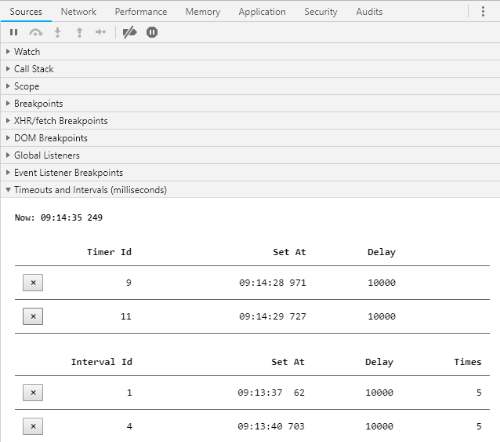

# Timeouts And Intervals

Chrome devtools extension to display active timeouts and intervals. It is also possible to clear the active timeout or intervals.



## How it works

The extension inserts a script into the page (using a content script) that monkey patches the ```setTimeout```,
```clearTimeout```, ```setInterval``` and ```clearInterval``` to keep track of the timeout and interval
registration and clearing which are recorded in an object. It adds a devtools side panel called
```Timeouts and Intervals``` in the ```Sources``` tab that displayes that statistic when timeout or interval is
registered, triggers or is cleared. To clear the timeouts and intervals it exevutes the ```clearTimeout``` and
```clearInterval``` using ```chrome.devtools.inspectedWindow.eva(...)``` in the context of the page.

### Note

The extension cannot inject content script in the pages loaded using ```file://``` URLs.
The user must visit the extensions management page and opt in to allow ```file://``` URLs.

## How to install

You can install it from Chrome Web Store

[Timeouts and Intervals](https://chrome.google.com/webstore/detail/timeouts-and-intervals/oagmfffelnnohpbidjknmhfangoahcan)

## Known issues

- Timeouts and Intervals registered before the script gets injected may not be detected
